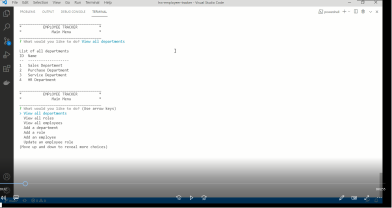

# Employeer Tracker

The Employee Tracker is an application which can be used to manage a company's employee database, using Node.js, Inquirer, and MySQL.

It allows a business owner to view and manage the departments, roles, and employees in the company so that he/she can organize and plan the business.

## Application Demo 
The following video shows an example of the application being used from the command line:

File available here: (assets/12-SQL-Homework-EmployeeTracker.mp4). Please download it to view.

